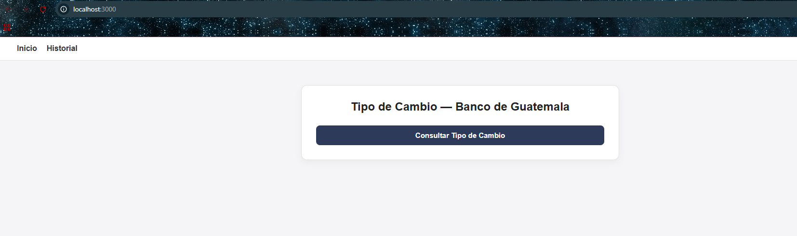

# INTRUCCIONES DE INSTALACION
Proyecto: Consumo del API de Tipo de Cambio del Banco de Guatemala
ste proyecto consiste en una aplicación web que consulta el tipo de cambio del Banco de Guatemala, lo muestra en una interfaz realizada con Next.js y lo guarda en una base de datos mariadb utilizando un backend desarrollado en Spring Boot.

### Prerrequisitos
- Java 17+
- Maven
- Node.js y npm
- MariaDB instalado (administrado con DBeaver)
- Editor o IDE (IntelliJ, VSCode, etc.)

## Configurar la base de datos
1. Abre el archivo application.properties el cual esta ubicado en "Backend\src\main\resources\application.properties"
Encontraras el siguiente codigo:
##
spring.application.name=Backend

server.port=8080

spring.datasource.url=jdbc:mysql://localhost:3306/monedadb
spring.datasource.username=root
spring.datasource.password=12345
spring.jpa.properties.hibernate.dialect=org.hibernate.dialect.MySQLDialect

spring.jpa.hibernate.ddl-auto=update
spring.jpa.show-sql=true

management.endpoints.web.exposure.include=*
##
2.Ingresa los datos de tu base de datos que usaras en username y password abajo de dejo nuevamente el codigo de referencia de como quedaria
##
spring.application.name=Backend

server.port=8080

spring.datasource.url=jdbc:mysql://localhost:3306/monedadb
spring.datasource.username=tuusuario
spring.datasource.password=tucontraseña
spring.jpa.properties.hibernate.dialect=org.hibernate.dialect.MySQLDialect

spring.jpa.hibernate.ddl-auto=update
spring.jpa.show-sql=true

management.endpoints.web.exposure.include=*

##
3.Luego de guardar los cambios Ejecutamos el backend mediante la clase BackendApplication.java, Esto lo encuentras en la siguiente ruta "Backend\src\main\java\com\backend\Backend\BackendApplication.java"
##
##
4. luego de ejecutar la clase nos vamos a la carpeta de Frontend, abrimos la terminal dentro de la direccion de la carpeta y ejecutamos los siguientes codigos uno por uno, ojo no ejecutar todos a la misma vez.
npm install
npm run dev
##
5. Seguidamente de haber ejecutado los codigos anteriores vamos al navegador e ingresamos la direccion http://localhost:3000 y con esto ya podemos visualizar en el navegador el menu de la app.

#TECNOLOGIAS UTILIZADAS
BACKEND
Java 17
Spring Boot
Hibernet
Maven

FRONTED
Next.js
CSS

BASE DE DATOS
MARIADB

OTROS 
API oficial del Banco de Guatemala (Servicio SOAP)

##CAPTURAS DE PANTALLA

##ESQUEMA DE BASE DE DATOS

Omitir lo siguiente es el esquema de la base de datos, la cual se creara automaticamente si todo se hizo bien en los pasos anteriores, lo adjunto por que la documentacion lo requiere

CREATE DATABASE IF NOT EXISTS monedadb;
USE monedadb;
CREATE TABLE `tipo_cambio` (
  `id` bigint(20) NOT NULL AUTO_INCREMENT,
  `fecha_consulta` datetime(6) DEFAULT NULL,
  `fecha_tipo_cambio` date DEFAULT NULL,
  `origen_api` varchar(255) DEFAULT NULL,
  `tipo_cambio` decimal(38,2) DEFAULT NULL,
  PRIMARY KEY (`id`)
) ENGINE=InnoDB AUTO_INCREMENT=18 DEFAULT CHARSET=utf8mb4 COLLATE=utf8mb4_uca1400_ai_ci;

